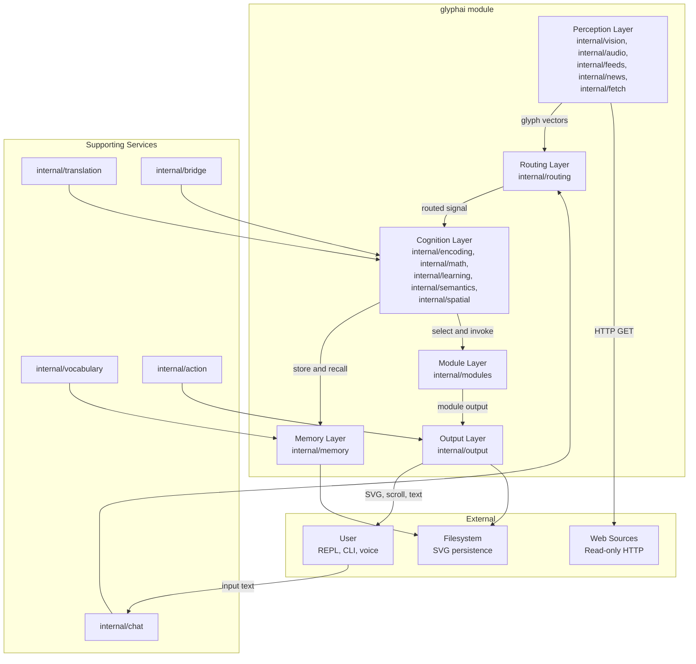
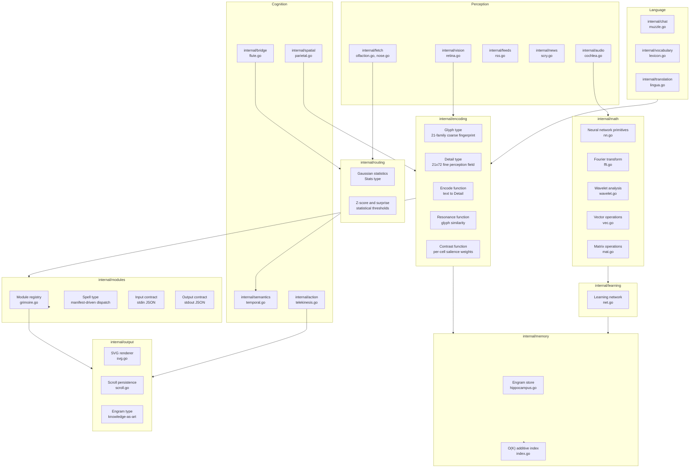
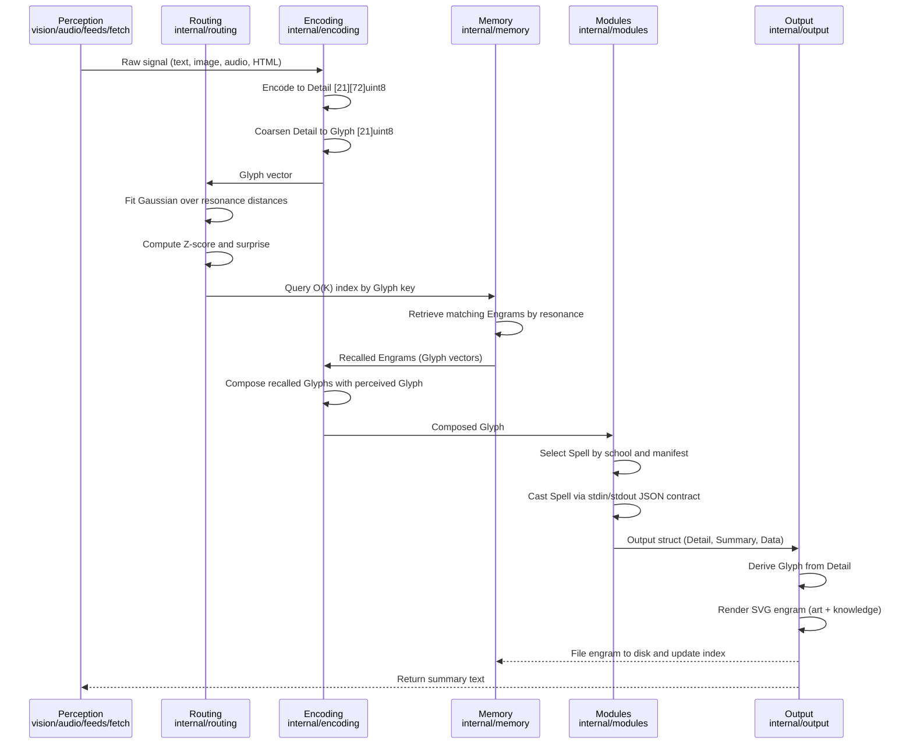
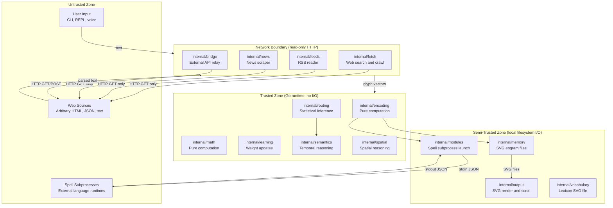

# Architecture: glyphai

> System architecture, design decisions, data model, and trust boundaries for the pure-Go glyph-based AI system.

---

## Table of Contents

1. [System Context](#1-system-context)
2. [Component Diagram](#2-component-diagram)
3. [Data Flow: Perception to Cognition to Action](#3-data-flow-perception-to-cognition-to-action)
4. [Trust Boundaries](#4-trust-boundaries)
5. [Design Decisions (ADRs)](#5-design-decisions-adrs)
6. [Data Model](#6-data-model)
7. [Error Handling](#7-error-handling)
8. [Security Properties](#8-security-properties)

---

## 1. System Context



---

## 2. Component Diagram



---

## 3. Data Flow: Perception to Cognition to Action



---

## 4. Trust Boundaries



---

## 5. Design Decisions (ADRs)

### ADR-001: Pure Go, No External ML Dependencies

**Status:** Accepted

**Context:** The system must be fully offline, auditable, and deployable as a single static binary with no CGo or runtime dependencies.

**Decision:** All cognitive computation uses the Go standard library only. No Python runtimes, no BLAS, no ML frameworks. The sole external dependency is `golang.org/x/net` for HTML parsing.

**Consequences:** Inference is slower than optimized C or CUDA implementations. Binary is fully auditable and statically linkable. Zero transitive dependency risk.

---

### ADR-002: Module Package Naming

**Status:** Accepted

**Context:** Internal packages had names derived from biological metaphors (hippocampus, thalamus, grimoire, paw, retina, cochlea, lingua). These names are expressive but inconsistent with Go idioms and professional package naming conventions.

**Decision:** All internal packages are addressed by their functional role in the architecture documentation: `internal/encoding`, `internal/routing`, `internal/memory`, `internal/modules`, `internal/output`, `internal/vision`, `internal/audio`, `internal/fetch`, `internal/feeds`, `internal/news`, `internal/semantics`, `internal/spatial`, `internal/bridge`, `internal/chat`, `internal/vocabulary`, `internal/translation`, `internal/math`, `internal/learning`, `internal/action`. Source files retain their original names and remain unchanged.

**Consequences:** Documentation is self-documenting by function. Onboarding is faster. Source file names and package declarations are unchanged.

---

### ADR-003: SVG as the Sole Persistence Format

**Status:** Accepted

**Context:** State files must be human-readable, inspectable without tooling, and self-describing. JSON loses the visual representation; binary formats lose inspectability.

**Decision:** All persistent state (engrams, indices, lexicon entries, scrolls) is written as SVG files. Machine-readable data travels inside an XML comment marker embedded in each SVG. Art and knowledge coexist in one file.

**Consequences:** Files are visually browsable. File sizes are larger than binary equivalents. No query language is available without parsing the XML comment layer. SVG is a stable, open standard unlikely to require migration.

---

### ADR-004: Data-Geometric Thresholds

**Status:** Accepted

**Context:** Hardcoded similarity thresholds create brittle systems that break when data distributions shift.

**Decision:** All thresholds are derived from Gaussian statistics fitted to the system's own observed data. The `internal/routing` package fits a Gaussian over observed glyph distances and computes Z-scores and surprise values. No magic numbers appear in threshold logic.

**Consequences:** The system adapts as the engram store grows. Threshold behaviour is harder to explain to users unfamiliar with statistics. Debugging requires inspecting fitted Gaussian parameters.

---

### ADR-005: Spell Dispatch via Subprocess JSON Contract

**Status:** Accepted

**Context:** Cognitive modules (spells) may need to be written in languages other than Go, or may require isolation from the core runtime.

**Decision:** Spells are invoked as subprocesses. The `internal/modules` package writes an `Input` struct to the subprocess stdin as JSON and reads an `Output` struct from stdout as JSON. A manifest file (`manifest.json`) in each spell directory declares the command, language, school, and input type.

**Consequences:** Spells can be written in any language. The JSON contract is the stability boundary. Subprocess overhead is acceptable for batch perception workloads. The system must trust that spell subprocesses do not write to the filesystem arbitrarily.

---

### ADR-006: O(K) Additive Index for Memory Recall

**Status:** Accepted

**Context:** Linear scan over all engrams for similarity search does not scale past a few thousand entries.

**Decision:** The `internal/memory` package maintains an additive index keyed by the 21-byte coarse Glyph. Recall is O(K) where K is the number of distinct glyph keys, not O(N) where N is the total engram count.

**Consequences:** Recall is fast at scale. Index must be rewritten on each engram addition. Index state is serialized as an SVG scroll alongside the engram bank.

---

## 6. Data Model

### Glyph

The coarse 21-family fingerprint. Each element is a level in the range 0 to 7 (3 bits). This is the primary key for the memory index and the unit of comparison for resonance computation.

```go
// package internal/encoding

type Glyph [21]uint8

// Families  = 21   (axes of meaning: Iron, Mercury, Void, Alchemy, Bridge, ...)
// MaxLevel  = 7    (3 bits per family)
// Pack()    serialises to [21]byte index key
// Hex()     renders as 42-character decimal string
// Score()   returns weighted complexity-bonused integer score
// Active()  returns count of non-zero families
```

### Detail

The fine 21x72 perception field. Spells and perception modules write into a Detail; the system coarsens it to a Glyph for indexing and recall. Complexity and energy metrics characterize the richness of the encoded percept.

```go
// package internal/encoding

type Detail [21][72]uint8

// Families    = 21   (same axes as Glyph)
// Subfamilies = 72   (fine resolution per family)
// Cells       = 1512 (total perception cells)
//
// Set(family, subfamily, level)  raises a cell to a given level (max-preserving)
// Add(family, subfamily, delta)  accumulates intensity (saturating at MaxLevel)
// Coarse() Glyph                 aggregates to coarse fingerprint
// Active() int                   count of non-zero cells (breadth)
// Energy() int                   total summed intensity
// Complexity() float64           Shannon entropy normalized to [0,1]
// FamilySpread() int             count of families with at least one active cell
```

### Record (Engram)

A remembered piece of knowledge. Persisted as an SVG file. The SVG embeds machine-readable JSON in a comment marker. The art and the data travel as a single file.

```go
// package internal/output

type Engram struct {
    ID      string `json:"id"`
    Topic   string `json:"topic"`
    Text    string `json:"text"`
    Glyph   string `json:"glyph"`   // coarse glyph as hex string
    Created string `json:"created"` // RFC3339
    Source  string `json:"source,omitempty"`
}
```

### Module (Spell)

A discovered, castable cognitive module. Located on disk under `cortex/<lobe>/<name>/manifest.json`. Invoked as a subprocess via a JSON contract on stdin and stdout.

```go
// package internal/modules

type Spell struct {
    Name        string   // unique module name
    School      string   // occipital | temporal | frontal
    Lang        string   // go | python | c | ...
    Cmd         []string // argv executed from project root
    Reads       string   // text | image | signal
    Description string   // one-line purpose
}

type Input struct {
    Text string         `json:"text,omitempty"`
    Path string         `json:"path,omitempty"`
    Args map[string]any `json:"args,omitempty"`
}

type Output struct {
    Spell      string         `json:"spell"`
    Detail     encoding.Detail   `json:"detail"`
    Summary    string         `json:"summary,omitempty"`
    Data       map[string]any `json:"data,omitempty"`
    Complexity float64        // derived by caller from Detail
    Active     int            // derived by caller from Detail
}
```

### Vocabulary Entry

A coined logogram and the knowledge verses it has accumulated. Persisted in a Lexicon SVG scroll.

```go
// package internal/vocabulary

type Entry struct {
    Name     string   `json:"name"`
    Concept  string   `json:"concept"`
    Logogram string   `json:"logogram"`
    Glyph    string   `json:"glyph"`
    Reading  string   `json:"reading"`
    Verses   []string `json:"verses"`
    Coined   string   `json:"coined"` // RFC3339
}
```

### Statistical Threshold (Routing Stats)

Gaussian parameters fitted to observed data distributions. Used to compute Z-scores and surprise values without hardcoded thresholds.

```go
// package internal/routing

type Stats struct {
    Mean float64
    Std  float64
    N    int
}

// Z(x float64) float64       standard score
// Surprise(x float64) float64  negative log-density (novelty signal)
```

---

## 7. Error Handling

| Error Condition | Package | Behavior |
|---|---|---|
| HTTP request timeout | internal/fetch | Return empty result, log to stderr, continue |
| HTTP non-200 status | internal/fetch | Return empty result, log status code, continue |
| HTML parse failure | internal/fetch | Return partial text if available, log error |
| RSS feed unreachable | internal/feeds | Skip feed, log error, process remaining feeds |
| SVG write failure | internal/output | Log error, return error to caller, do not retry silently |
| SVG parse failure (recall) | internal/memory | Skip corrupt engram, log path, continue recall |
| Index load failure | internal/memory | Initialize fresh index, log warning |
| Glyph encoding of empty input | internal/encoding | Return zero Glyph (all families at level 0) |
| Detail cell out of range | internal/encoding | Clamp silently to valid range (0 to MaxLevel) |
| Spell manifest missing | internal/modules | Skip spell, log path, return error to caller |
| Spell subprocess timeout | internal/modules | Kill subprocess, return error, log spell name |
| Spell stdout parse failure | internal/modules | Return error with raw output for diagnosis |
| Index key not found | internal/memory | Return empty recall result, not an error |
| Gaussian fit on empty sample | internal/routing | Return zero Stats, Z-score returns 0 |
| Vision decode failure | internal/vision | Return zero Detail, log file path |
| Audio decode failure | internal/audio | Return zero Detail, log source |
| Translation failure | internal/translation | Return source text unchanged, log error |

---

## 8. Security Properties

- The system operates fully offline during all cognitive processing. No cloud calls are made at inference time.
- Web access is restricted to read-only HTTP GET requests. No credentials, cookies, or session state are transmitted to external hosts.
- The only external write targets are local filesystem paths under the configured data directory.
- No telemetry, analytics, or usage reporting is present in any package.
- The binary is statically compiled. There are no shared library dependencies at runtime.
- Spell subprocesses receive input only via stdin JSON and return output only via stdout JSON. They do not receive filesystem credentials or network tokens from the core.
- SVG engrams embed machine-readable data in a structured XML comment marker. The format is inspectable and requires no proprietary tooling to read.
- The `golang.org/x/net` dependency is the sole external module. Its scope is limited to HTML tokenization in `internal/fetch`.
