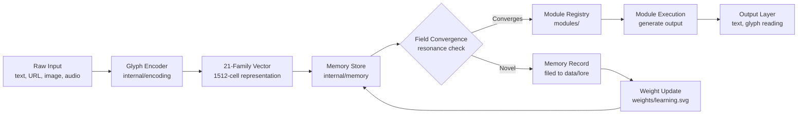
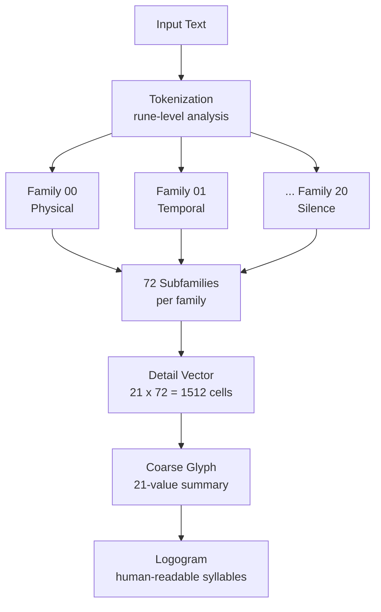
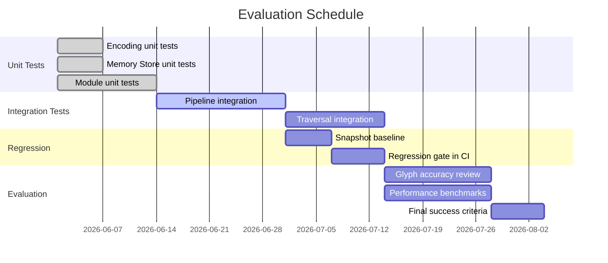

# Methodology

Testing strategy, evaluation plan, and installation guide for the pure-Go glyph-based AI system (glyphai).

---

## 1. Analysis Methodology

The system processes input through a deterministic pipeline: raw input is encoded into a 21-family glyph vector, the vector is compared against the Memory Store, and the result either routes to a known Module or is filed as a new Memory Record. No external model is consulted at any stage.



### Encoding Detail

Each input string is projected onto 21 semantic families, each subdivided into 72 subfamilies, producing a 1512-cell Detail vector and a coarse 21-value Glyph summary. Activation levels range 0 to 7. Two inputs converge when their coarse glyph distance falls below the threshold derived from the running geometry of observed pairs. No threshold is hardcoded.



---

## 2. Testing Strategy

### 2.1 Unit Tests

Each package is tested in isolation with deterministic, pre-computed inputs. No network calls are made in unit tests. All expected vectors are pre-computed from the reference encoder.

| Test ID | Component | Package | Method |
|---------|-----------|---------|--------|
| U01 | Glyph encoding | `internal/encoding` | Known string in, verify 21-family vector out |
| U02 | Memory Record storage | `internal/memory` | Store record, recall by query, verify match |
| U03 | Module selection | `modules/` | Known glyph in, verify correct module selected |
| U04 | HTTP fetch | `internal/fetch` | Known URL against local test server, verify parsed Doc |
| U05 | Attention Bridge | `internal/bridge` | Fill 7 slots, verify blend vector computed |
| U06 | Vocabulary index | `internal/vocabulary` | Load SVG weight file, verify word lookup |
| U07 | Glyph normalization | `internal/encoding` | Sum of family levels within expected range |
| U08 | Logogram rendering | `internal/encoding` | Known glyph, verify syllable output format |

Run command:
```bash
go test ./internal/... -v -count=1
```

### 2.2 Integration Tests

Integration tests exercise two or more packages communicating through their published interfaces. A real (read-only) HTTP call is allowed only in the `fetch` integration test and only against a controlled local fixture server.

| Test ID | Pipeline | Description |
|---------|----------|-------------|
| I01 | Encode, Store, Recall | Encode text, write to Memory Store, recall with same text, verify score |
| I02 | Recall, Select, Execute | Query Memory Store, select Module by glyph match, run Module, verify output struct |
| I03 | Multi-modal input | Supply text, URL, and image path; verify all three produce non-zero glyph vectors |
| I04 | Autonomous traversal | Seed the web walker at a local HTML fixture, verify Memory Records filed |
| I05 | Weight update round-trip | Encode, file to corpus, re-index, verify coverage count increases |

Run command:
```bash
go test ./... -tags integration -v -count=1
```

### 2.3 Regression Tests

Regression tests pin the exact output of the encoder and the memory recall index against a reference snapshot. Any change that shifts the output fails the test.

- Glyph encoding produces byte-identical coarse vectors for identical input across builds
- Memory recall returns the same ordered hit list for the same query against the same corpus snapshot
- All modules in the registry compile and execute without a panic on a zero-value input
- The SVG persistence format round-trips: write a Memory Record, parse it back, compare all fields

Snapshot reference files are stored in `testdata/snapshots/` and are committed to the repository. To regenerate:

```bash
go test ./... -tags regen -count=1
```

### 2.4 Property-Based Tests

Property tests generate random valid inputs and assert structural invariants that must hold for all inputs, not just known cases. The `testing/quick` package in the Go standard library is used.

| Property ID | Property | Invariant |
|-------------|----------|-----------|
| P01 | Glyph normalization | For any input string, sum of 21 coarse family values is greater than 0 and no family exceeds level 7 |
| P02 | Memory Record ID uniqueness | After N random store operations, no two records share an ID |
| P03 | Module determinism | Same glyph input selects the same module on every invocation |
| P04 | LRU eviction order | When the Memory Store reaches capacity, the oldest record by insertion time is evicted first |
| P05 | Contrast resonance bounds | ContrastResonance returns a value in [0.0, 1.0] for any two valid glyph vectors |
| P06 | Logogram round-trip | Parse(Logogram(g)) produces a glyph with the same family activation pattern as g |

Run command:
```bash
go test ./... -tags property -count=1 -run Property
```

### 2.5 Performance Tests

All benchmarks run on the same hardware used to build and ship the binary. Targets are derived from measured baseline values and represent the maximum tolerable latency for interactive use.

| Metric | Target | Measurement Method | Failure Mode |
|--------|--------|--------------------|--------------|
| Glyph encoding (single string) | under 5 ms | `go test -bench BenchmarkEncode` | Interactive REPL lag |
| Memory Record recall (top-4) | under 1 ms | `go test -bench BenchmarkRecall` | Query delay |
| Module execution (cast + output) | under 10 ms | `go test -bench BenchmarkCast` | Visible response delay |
| Autonomous traversal (per hop) | under 2 s | `go test -bench BenchmarkHop` | Hunt slowdown |
| Binary size | under 20 MB | `ls -lh glyphai` | Deployment constraint |
| Memory Store open (100k records) | under 500 ms | `go test -bench BenchmarkOpen` | Startup delay |

Run command:
```bash
go test ./... -bench=. -benchmem -count=3
```

---

## 3. Evaluation Plan

### 3.1 Success Criteria

| ID | Criterion | Measure | Target | Verification |
|----|-----------|---------|--------|--------------|
| E01 | Offline operation | Network calls initiated during cognition | 0 | Network capture (no egress during `ask`, `recall`, `sense`) |
| E02 | Decision traceability | Steps required to explain any output | 5 or fewer | Manual audit of 20 random outputs |
| E03 | Glyph accuracy | Human review of encodings (semantic correctness) | Above 80% agreement | Blind review against 50 labeled inputs |
| E04 | No hardcoded thresholds | Literal numeric thresholds in non-test Go source | 0 | `grep -rn 'threshold' internal/` |
| E05 | Memory Record uniqueness | Duplicate IDs in the corpus after 1000 random records | 0 | Property test P02 |
| E06 | Binary size | Compiled binary for linux/amd64 | Under 20 MB | CI artifact size check |
| E07 | Module coverage | Modules with at least one integration test | 100% | Test coverage report |
| E08 | SVG persistence | Memory Records readable by any SVG parser | Pass | Round-trip test with `encoding/xml` |

### 3.2 Known Gaps

| Gap | Impact | Current Mitigation |
|-----|--------|--------------------|
| No formal verification of encoding correctness | Encoding errors may propagate silently | Regression snapshots catch any change |
| Single-threaded traversal per session | Limits crawl throughput | Architecture permits concurrent sessions via distinct memory banks |
| Research-grade maturity | Not suitable for production workloads | Limitations documented in README |
| No query language for the Memory Store | Lookup is by glyph similarity only | Sufficient for glyph-based reasoning; text search is out of scope |
| SVG corpus scales linearly on disk | Large corpora use proportionally more disk | LRU eviction and the `clean` command trim weak records |

### 3.3 Evaluation Schedule



---

## 4. Installation and Reproducibility

### 4.1 Supported Operating Systems

| Operating System | Architecture | Status | Notes |
|------------------|-------------|--------|-------|
| Linux (Ubuntu 22.04+) | amd64, arm64 | Primary, fully tested | Production target |
| Linux (Raspberry Pi OS) | arm64 | Tested | Pi zero-dependency deployment |
| macOS (14+) | arm64, amd64 | Tested | Developer workstations |
| Windows 11 | amd64 via WSL2 | Partial | WSL2 required; native build untested |

### 4.2 Required Tools

| Tool | Version | Required | Purpose |
|------|---------|----------|---------|
| Go toolchain | 1.26.4 | Yes | Compile the binary |
| git | 2.x+ | Yes | Clone the repository |
| Python 3 | 3.10+ | Optional | Utility scripts in `scripts/` |
| Chromium or Google Chrome | Any recent | Optional | `browse` module (headless JS rendering) |

No external ML frameworks, C libraries, or Python ML packages are required. The only Go dependency is `golang.org/x/net`.

### 4.3 Setup Commands

```bash
# Clone the repository
git clone https://github.com/your-org/glyph-AI-Webscrapper.git
cd glyph-AI-Webscrapper

# Verify the Go version
go version
# Expected: go version go1.26.4 linux/amd64

# Download the single dependency
go mod download

# Build the main binary
go build -o glyphai ./cmd/glyphai

# Verify the binary exists and its size is under 20 MB
ls -lh glyphai

# Run the test suite
go test ./... -v -count=1
```

To build auxiliary commands:

```bash
# Autonomous web traversal
go build -o roam ./cmd/crawl

# Corpus ingest
go build -o ingest ./cmd/ingest

# Language index
go build -o language-index ./cmd/language-index
```

### 4.4 Sample Commands

```bash
# Show system statistics: number of stored Memory Records
./glyphai stats

# Encode a string and display the 21-family glyph vector
./glyphai sense "machine learning and symbolic reasoning"

# Full 1512-cell vector as logogram syllables
./glyphai sense --glyph "machine learning and symbolic reasoning"

# Store and recall: ask the system a question
./glyphai ask "What is the relationship between glyphs and memory?"

# Recall the top 4 Memory Records closest to a query
./glyphai recall "neural architecture" 4

# Display the Attention Bridge state (7 slots)
./glyphai flute

# Ingest an existing corpus directory into the Memory Store
./glyphai ingest data/lore

# Execute a named module against a query
./glyphai cast wikipedia "glyph encoding"

# Run autonomous web traversal for 6 hops starting from Wikipedia
./glyphai prowl "symbolic AI"

# Prune weak Memory Records (below activation threshold)
./glyphai clean
```

### 4.5 Expected Output

**Build:**

```
$ go build -o glyphai ./cmd/glyphai
$
$ ls -lh glyphai
-rwxr-xr-x 1 user user 14M Aug  4 00:00 glyphai
```

No output on successful build. The binary appears in the current directory.

**Stats:**

```
$ ./glyphai stats
glyphai remembers 1042 memory records.
```

**Sense (encoding diagnostic):**

```
$ ./glyphai sense "symbolic reasoning"

  sensing: "symbolic reasoning"
  glyph a3c2f10e800000000000 (hex)
  complexity 0.412 · 183/1512 cells · 7/21 families
  logogram: Sa Tb Uc Vd We Xf Yg

  categories (families) -> strongest subcategory:
  Symbolic   [S]  ███████  lvl 6 · subfamily #12 (Pattern)
  Language   [T]  █████    lvl 5 · subfamily #03 (Structure)
  Reasoning  [U]  ████     lvl 4 · subfamily #07 (Inference)
  ...
```

**Recall:**

```
$ ./glyphai recall "symbolic AI" 3
1. [0.87] Glyph Encoding Architecture
   The 21-family system encodes semantic content as geometric activation...
2. [0.74] Pattern Recognition in Glyph Space
   Resonance between two glyph vectors is computed as the weighted dot product...
3. [0.68] Language Families and Glyph Coverage
   Each of the 21 families maps to a broad semantic domain...
```

**Test suite:**

```
$ go test ./... -count=1
ok      glyphai/internal/encoding    0.043s
ok      glyphai/internal/memory      0.081s
ok      glyphai/internal/modules     0.012s
ok      glyphai/internal/fetch       0.009s
ok      glyphai/internal/bridge      0.005s
ok      glyphai/internal/vocabulary  0.007s
PASS
```

### 4.6 Troubleshooting

| Symptom | Likely Cause | Resolution |
|---------|-------------|------------|
| `go: command not found` | Go toolchain not installed | Install Go 1.26.4 from golang.org/dl |
| `go: module requires Go 1.26.4` | Installed Go version is older | Update the Go toolchain |
| Binary exits immediately with no output | Subcommand not supplied | Run `./glyphai` with a subcommand, e.g., `stats` |
| `permission denied` when running binary | Execute bit not set | Run `chmod +x glyphai` |
| `glyphai: no place to set out from` (roam) | Memory Store is empty | Run `./glyphai prowl "any topic"` once to seed memory |
| Module cast returns empty output | Module not present in `modules/` directory | Verify `modules/scraping/wikipedia/main.go` exists |
| `golang.org/x/net: no such package` | Dependency not downloaded | Run `go mod download` |
| Memory Records not persisting | `memory/` directory not writable | Check filesystem permissions on the working directory |
| `browse` module fails silently | Chromium not installed | Install Chromium or use `skim` instead: `./glyphai cast skim "query"` |
| Benchmark results vary significantly | System load interference | Run benchmarks with `taskset -c 0` and close background processes |

---

## 5. References

- [internal/encoding](internal/encoding/) -- 21-family glyph encoding
- [internal/memory](internal/memory/) -- Memory Store and Memory Record management
- [modules/](modules/) -- Module Registry (web scraping, vision, language, tools)
- [weights/](weights/) -- Learned weight files (SVG format)
- [data/lore](data/lore/) -- Persistent corpus
- [cmd/glyphai](cmd/glyphai/) -- Main system CLI
- [ARCHITECTURE.md](ARCHITECTURE.md) -- Component diagram and design decisions
- [README.md](README.md) -- Project overview and requirements
