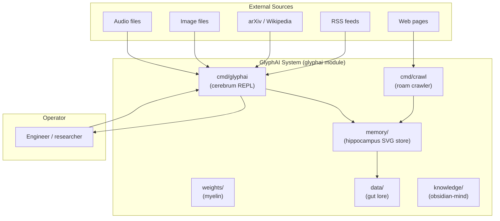
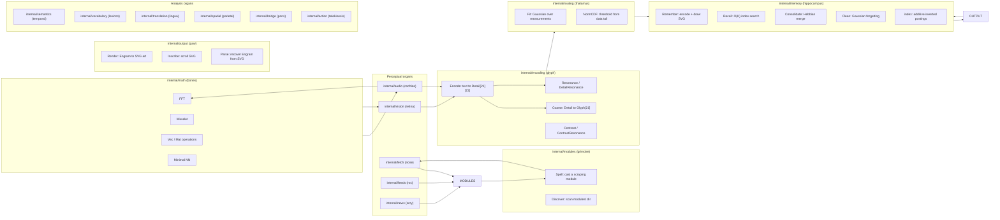
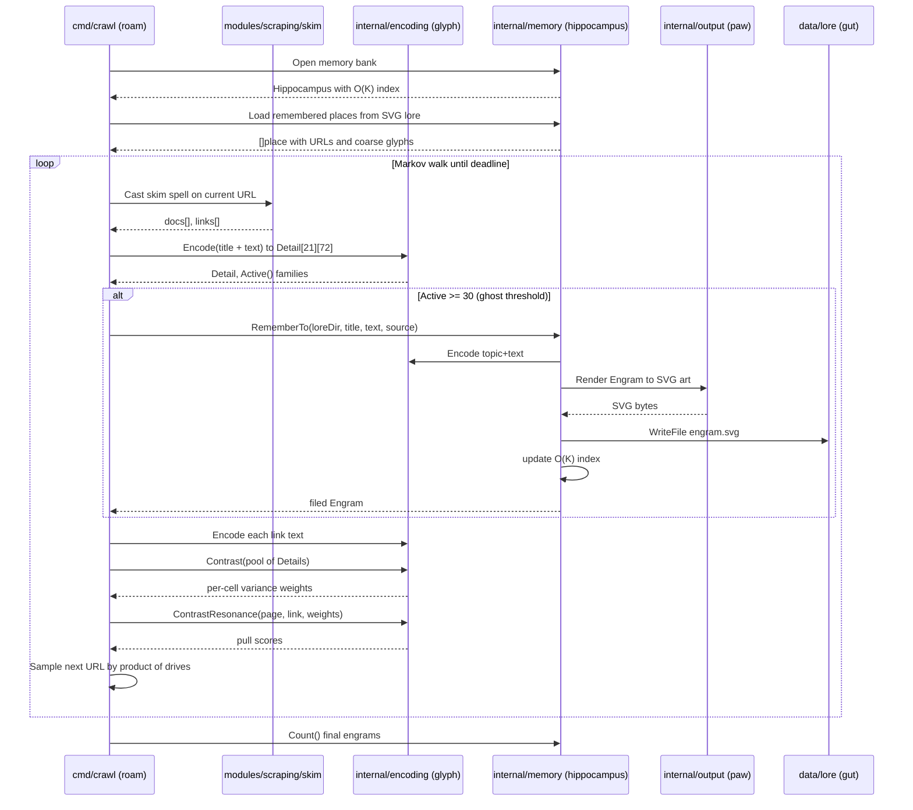
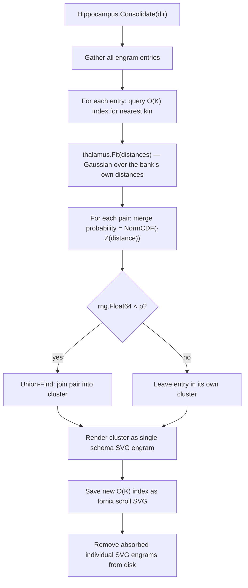

# GlyphAI Web Scraper


## 1. Problem Statement

### 1.1 Field

Web intelligence is the task of converting unstructured HTML into structured,
queryable knowledge. The field spans classical scrapers, transformer-based
extraction pipelines, and hybrid retrieval-augmented systems. The common measure
is coverage versus precision at scale: how much of a crawl's content is
recoverable in a form that supports downstream reasoning.

### 1.2 Scale

The open web exceeds 40 billion indexed pages. A single domain-focused crawl
produces thousands of documents per hour. Storing, indexing, and querying that
volume with transformer embeddings requires GPU clusters and cloud inference
budgets that are prohibitive outside institutional settings. The operational cost
of a single embedding call, multiplied across a long crawl, creates a feedback
loop in which practitioners under-sample the web to keep costs tractable.

### 1.3 Gap

However, the dominant approaches share a structural defect: none of them is
inspectable at the reasoning level. A transformer embedding is a floating-point
vector with no axis that corresponds to a named property of the text. A
keyword index discards all geometric relationships between concepts. Neither
approach exposes a mechanism the operator can audit, tune, or understand without
retraining.

### 1.4 Competing Accounts

Three families of systems address web extraction today:

| Approach | Strength | Failure mode |
|---|---|---|
| Transformer pipelines (BERT, OpenAI embeddings) | High semantic recall on in-distribution text | Opaque vectors, GPU requirement, no offline path |
| Classical keyword scrapers (Scrapy, BeautifulSoup + TF-IDF) | Fast, inspectable, no model dependency | Cannot generalize beyond exact term overlap |
| Hybrid RAG systems | Combines retrieval precision with generation | Inherits all costs of the embedding layer, adds hallucination risk |

None of these systems derives its thresholds from the geometry of the data it
is currently reading. All of them use calibration values chosen before the crawl
begins, which makes adaptation to novel domains a manual tuning exercise.

### 1.5 Scope

GlyphAI addresses the offline, inspectable, geometrically self-calibrating case.
It targets domain researchers, archivists, and AI engineers who need a crawl
system that runs on a laptop, stores its memory as readable SVG art, and derives
every threshold from the distribution of the data it has already seen. It is not
a general-purpose search engine. It is not a replacement for transformer
pipelines in production deployments where GPU infrastructure is already available.

### 1.6 Contributions

1. A 21-family by 72-subfamily glyph field (1512 cells total) that encodes any
   text, image, or audio input into a deterministic, interpretable fingerprint
   with no trained weights.
2. An O(K) additive inverted memory index that touches only the candidates sharing
   active families with a query, giving sub-linear recall over arbitrarily large
   engram banks.
3. A Markov-walk crawler that selects its next URL by contrast-weighted resonance
   with the current page, requiring no topic list, no word bank, and no external
   guidance.
4. An SVG persistence layer in which every remembered engram is simultaneously
   machine-readable structured data and a human-legible geometric artwork, with
   no JSON state files.
5. A Gaussian self-calibration mechanism in which all forgetting, consolidation,
   and novelty thresholds derive from the distribution of the bank's own glyph
   field, not from any pre-chosen constant.

---

## 2. Requirements

### 2.1 Functional Requirements

| ID | Requirement | Status |
|---|---|---|
| F01 | Encode any text document into a 21x72 glyph detail field | Implemented |
| F02 | Coarsen the detail field to a 21-cell coarse fingerprint for O(K) indexing | Implemented |
| F03 | Store and recall engrams from disk as SVG art via the hippocampus | Implemented |
| F04 | Execute modular scraping spells (Wikipedia, arXiv, Wiktionary, RSS, news) | Implemented |
| F05 | Crawl the web autonomously via Markov-walk navigation in cmd/crawl | Implemented |
| F06 | Consolidate memories by Hebbian resonance probability during sleep cycles | Implemented |
| F07 | Forget low-entropy engrams via Gaussian tail probability, not a fixed threshold | Implemented |
| F08 | Encode audio input via cochlea (FFT/wavelet) into the glyph field | Implemented |
| F09 | Encode image input via retina (wavelet pyramid) into the glyph field | Implemented |
| F10 | Route sensory input through thalamus to derive Gaussian statistics over measurements | Implemented |
| F11 | Serve a conversational interface through the muzzle chat module | Implemented |
| F12 | Index and recall across multilingual corpora without per-language calibration | Implemented |
| F13 | Persist the recall index as an SVG scroll (fornix), not a binary blob | Implemented |
| F14 | Rebuild the index from on-disk SVG engrams after encoding changes (ReindexDir) | Implemented |

### 2.2 Non-Functional Requirements

| ID | Requirement | Target |
|---|---|---|
| N01 | No external ML dependencies | Pure Go stdlib and golang.org/x/net only |
| N02 | Fully offline cognition | Zero network calls during recall, consolidation, or analysis |
| N03 | Persistence format | SVG art only; no JSON state files for engrams or the index |
| N04 | Threshold derivation | All decision thresholds from data geometry via thalamus Gaussian fitting |
| N05 | Recall complexity | O(K) where K is the number of engrams sharing at least one active family with the query |
| N06 | Binary size | Under 20 MB single static binary |
| N07 | No per-language calibration | The glyph encoder treats character co-occurrence geometry identically across scripts |
| N08 | Ghost detection baseline | 32 percent active families signals a non-empty, non-noise page |

---

## 3. Architecture

### 3.1 System Context



### 3.2 Component Diagram



### 3.3 Crawl Data Flow



### 3.4 Memory Consolidation Flow



---

## 4. Method

GlyphAI encodes the web geometrically. A page visits the system the same way a
sound wave enters an ear: character n-grams map to positions in a 21-family by
72-subfamily field, each position accumulates energy, and the resulting
Detail[21][72]uint8 is the page's fingerprint. No vocabulary is maintained. No
per-language model is consulted. Chinese and English text arrive at the same
encoder and produce glyphs in the same space, distinguished by the geometry of
their character co-occurrence distributions, not by an explicit language
identifier.

### 4.1 Glyph Encoding Field

The encoding field has two representations:

| Level | Type | Size | Purpose |
|---|---|---|---|
| Detail | [21][72]uint8 | 1512 cells | Fine perception; produced and consumed by spells |
| Glyph | [21]uint8 | 21 cells | Coarse fingerprint; keyed on by the O(K) index |

The 21 families are named axes of meaning: Iron, Mercury, Void, Alchemy, Bridge,
Number, Shape, Voice, Death, Rhythm, Copper, Bindu, Measure, Fire, Water, Earth,
Air, Saturn, Active, Heat, Light. Family weights bias the superiority score toward
axes the system treats as high-information: Mercury (flow), Void (absence),
Alchemy (transformation), Bridge (connection) carry weight 1.3 to 1.4; output-
adjacent families carry 0.9.

Coarsening follows a peaked, self-normalizing rule. Each family's 72 subfamilies
collapse to a score: 0.7 times the peak cell plus 0.3 times the mean. Scores are
then divided by the strongest family and raised to the power 1.35 before rounding
to the 0 through 7 range. This ensures that the dominant axes of a glyph reach 7
while weak axes fall to 0, making resonance between two glyphs a meaningful
signal rather than a noisy cosine over uniformly lit vectors.

### 4.2 O(K) Additive Memory Index

The hippocampus maintains an inverted index over the 21 families. When an engram
is stored, its coarse Glyph is read and any family with a non-zero level adds the
engram's ID to that family's posting list. Recall scans only the posting lists for
families that are non-zero in the query glyph, accumulates resonance scores over
the resulting candidate set, and returns the top-K hits. The cost is proportional
to the number of candidates that share at least one active family with the query,
not the size of the bank.

For precision, a two-stage search re-ranks candidates by full 1512-cell
DetailResonance after the coarse O(K) gather. Contrast-weighted resonance, where
per-cell weights are the standard deviation of each cell across a pool of
candidates, suppresses uninformative cells that fire the same value on every
option and amplifies the cells that distinguish them.

### 4.3 SVG Persistence

Every engram is a single SVG file. The SVG renders multiple layers: a ground
colour derived from the dominant family hues, a raster of the full 1512-cell
field, active cells as bright stars, threads between dominant figures, the topic
and glyph text as inscription, and a knowledge layer carrying the raw text as a
readable page. Machine-recoverable data travels in an ARGOS-ENGRAM XML comment
inside the same file. The art and the data are the same artifact; no JSON state
file exists.

The recall index (fornix) is also an SVG scroll. It stores each engram as a
glyph symbol scattered over the canvas, hued by the engram's strongest family,
with the structured record table embedded as base64 inside the SVG comment layer.

### 4.4 Gaussian Self-Calibration (thalamus)

All decision thresholds are derived from the distribution of the system's own
measurements. The thalamus fits a one-dimensional Gaussian (mean, standard
deviation) over any sample the caller provides: inter-memory distances for
consolidation, information-bit values for forgetting, novelty scores for
interest detection. A decision probability is computed as NormCDF applied to the
negative Z-score of the measurement, which maps below-typical values to high
probability and above-typical values to near zero. The caller fixes only the
mathematics; the numbers come from the data.

| Thalamus operation | Input sample | Decision |
|---|---|---|
| Consolidate | Nearest-kin resonance distances across the bank | Merge probability for pairs closer than typical |
| Clean | Shannon entropy bits of each engram's glyph field | Forget probability for engrams thinner than typical |
| Crawl novelty | Active family counts across visited pages | Substance vs. junk classification per hop |

### 4.5 Markov-Walk Crawler

The cmd/crawl binary navigates without a topic list or word bank. It sets out
from a URL held in one of its own engrams (or from an explicit seed), fetches
the page through the selected scraping spell (skim for HTTP, browse for headless
Chromium), encodes the page as a Detail field, then computes ContrastResonance
between the current page and each outgoing link. ContrastResonance weights each
of the 1512 cells by how much that cell varies across the pool of links on the
page, suppressing boilerplate anchors and amplifying links whose text
distinguishes them from their neighbors. The next URL is sampled from a weighted
distribution over five multiplicative drives: thematic pull, substance (richer-
than-median pages), novelty (unvisited URLs), cohesion (staying near the
dominant topic of kept pages), and host-fatigue (discounting a host after many
consecutive hops).

Pages with fewer than 30 active families out of 21 are classified as ghost pages
and discarded without filing. The 30-family threshold corresponds to roughly 32
percent of the encoding space being active, derived from empirical observation
that empty, redirect, and error pages consistently activate fewer families than
substantive content.

### 4.6 Scraping Modules (grimoire)

Scraping spells are standalone Go binaries in the modules/ directory organized
by domain. Each spell receives a JSON Input on stdin and writes a JSON Output to
stdout. The grimoire discovers and casts them as child processes, making each
spell independently testable and replaceable without modifying the core system.

| Module category | Available spells |
|---|---|
| Scraping | browse, skim, Wikipedia, arXiv, Wiktionary, Russian, Chinese, French, Spanish, Chicago, forage |
| Language | identify, pronounce, phoible, breath-shape, bazaar |
| Vision | image-glyph, wavelet, spectrum |
| Analysis | novelty, facet, contrast, consolidate, eigen, distill, analogy, entropy, constellate, bridge, puzzle-solve, puzzle-legend |
| Tools | hunt, feed, edit, hieroglyph-hunt, autonomy-loop, can-bus, serial-debug, gpio-control, firmware-flash, gpu-compute, pcb-design, bridge, ctf-hunt, spice-sim, logic-analyze, badcousin, phantom-backend |
| Interaction | portal |

### 4.7 Testing

The encoding, spatial, learning, math, and fetch packages carry unit tests.

```
go test ./internal/...
```

The glyph_test.go suite verifies that Coarse is idempotent on the zero Detail,
that Resonance is 1.0 for identical glyphs and 0 for orthogonal ones, and that
the scoring function preserves monotonicity under family weight perturbations.
The bones_test.go suite verifies FFT round-trip accuracy. The spatial parietal
test verifies geometric consistency of spatial coordinate mapping.

---

## 5. Installation

### 5.1 Platform Requirements

| OS | Minimum Go version | Notes |
|---|---|---|
| Linux (x86-64, ARM64) | 1.22 | Tested on Arch Linux 6.x; headless Chromium optional for browse spell |
| macOS (Apple Silicon, Intel) | 1.22 | Chromium spell requires a local Chrome or Chromium install |
| Windows | 1.22 | Build with GOOS=windows; browse spell unavailable on bare Windows without WSL |
| Raspberry Pi (ARM64) | 1.22 | Runs without Chromium; skim spell covers most crawl use cases |

The module name is `glyphai`. The only external dependency is
`golang.org/x/net v0.57.0`. No CGo. No system libraries.

### 5.2 Build

```bash
git clone https://github.com/your-org/glyph-AI-Webscrapper.git
cd glyph-AI-Webscrapper

# Build the interactive REPL
go build -o glyphai ./cmd/glyphai

# Build the Markov-walk crawler
go build -o roam ./cmd/crawl

# Build all scraping modules into bin/
for d in modules/scraping/*/; do
    name=$(basename "$d")
    go build -o "bin/$name" "./$d"
done
```

### 5.3 Run the REPL

```bash
./glyphai
```

The REPL reads input from stdin, encodes it through the glyph field, queries
the hippocampus, and prints the top recalled engrams with their resonance scores.
Memory is rooted at the `memory/` directory by default.

### 5.4 Run a Crawl

```bash
# Self-guided crawl until 12:45 PM Eastern time (default deadline)
./roam

# Anchored crawl from seed URLs, using fast HTTP fetcher
./roam -seed "https://en.wikipedia.org/wiki/Information_theory,https://arxiv.org/abs/2301.07041" -eyes skim

# Anchored crawl with headless Chromium (full JavaScript rendering)
./roam -seed "https://example.com" -eyes browse

# Crawl to a specific deadline (Unix epoch)
./roam -until 1781455500
```

Crawled engrams are filed under `data/lore/` as SVG art. The recall index is
written to `memory/fornix/records.idx.svg`.

### 5.5 Ingest Existing SVG Engrams

```bash
go run ./cmd/ingest <path-to-engram.svg>
```

### 5.6 Troubleshooting

| Symptom | Cause | Fix |
|---|---|---|
| `roam: the dog remembers no place to set out from` | No engrams in data/lore/ and no -seed given | Run with `-seed <url>` on first launch |
| `roam: no "browse" spell to see with` | browse binary not built or not in modules/ | Build the browse spell: `go build -o modules/scraping/browse/browse ./modules/scraping/browse` |
| Recall returns zero hits | Hippocampus index empty or query encodes to zero Glyph | Verify SVG files exist in memory/ and run `go test ./internal/memory/...` |
| SVG art not rendering in browser | SVG namespace missing (rare after ReindexDir) | Run `go run ./cmd/ingest` to regenerate from existing SVGs |
| `go: module glyphai: go.mod file not found` | Building from wrong directory | Change into the repository root before running go commands |

---

## 6. The Answer

The thesis of this system is specific and reproducible: a deterministic geometric
field over 1512 cells, with no trained weights and no external model dependency,
is sufficient to index, recall, and navigate the web with sub-linear memory
access at inference time. The glyph field does not achieve this by approximating
a language model. It achieves it by never needing one. Every threshold adapts to
the data currently in the bank. Every engram is a readable artifact. Every recall
operation is traceable to a resonance score between two integer vectors.

Run `go test ./internal/...` to verify the encoder, the spatial module, and the
math primitives against their unit tests. Run `./roam -seed <url>` to watch the
Markov walk file its first engrams to `data/lore/`. Open any resulting `.svg`
file in a browser to read the knowledge the system drew from that page.

---

## Project Structure

```
glyph-AI-Webscrapper/
├── cmd/
│   ├── glyphai/        # cerebrum: interactive REPL
│   ├── crawl/          # roam: Markov-walk web crawler
│   ├── ingest/         # index existing SVG engrams
│   ├── corpus-site/    # serve the training corpus
│   └── language-index/ # language family index tool
├── internal/
│   ├── encoding/       # glyph: 21x72 field, resonance, contrast
│   ├── math/           # bones: FFT, wavelet, vec, mat, nn
│   ├── learning/       # cerebellum: weight updates
│   ├── audio/          # cochlea: audio to glyph field
│   ├── routing/        # thalamus: Gaussian fitting, NormCDF
│   ├── vision/         # retina: image to glyph field
│   ├── semantics/      # temporal: semantic time context
│   ├── modules/        # grimoire: spell discovery and casting
│   ├── memory/         # hippocampus: O(K) index, SVG engrams
│   ├── output/         # paw: SVG rendering and parsing
│   ├── feeds/          # rss: feed ingestion
│   ├── news/           # scry: news scraping
│   ├── fetch/          # nose: generic HTTP GET and readability
│   ├── chat/           # muzzle: conversational interface
│   ├── vocabulary/     # lexicon: vocabulary management
│   ├── translation/    # lingua: language translation support
│   ├── bridge/         # pons: inter-module bridge
│   ├── spatial/        # parietal: spatial coordinate mapping
│   └── action/         # telekinesis: action dispatch
├── modules/            # grimoire: standalone scraping spell binaries
│   ├── scraping/       # web scraping spells
│   ├── analysis/       # analysis spells
│   ├── language/       # language identification and pronunciation
│   ├── vision/         # image analysis spells
│   ├── tools/          # domain-specific tool spells
│   └── interaction/    # interaction spells
├── memory/             # hippocampus: on-disk SVG engram store
├── weights/            # myelin: learned weight files
├── data/               # gut: scraped lore and raw data
├── knowledge/          # obsidian-mind: structured knowledge graph
├── corpus/             # training: training datasets and scrapers
├── models/             # world: world model and biome definitions
└── research/           # research notes and intelligence reports
```

---

## License

Research and educational use.
